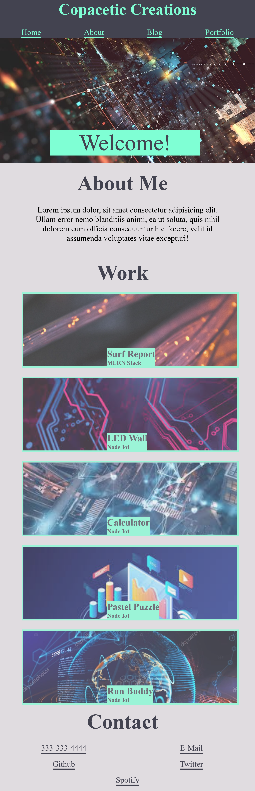

# Hello There!
My name is Marko Majetic, I am a budding web developer and this repository contains my portfolio website.
This webpage contains a header with links to different sections on the webpage with an About Me section
that gives a concise summary of who I am and what my coding capabilities can achieve.
There is a work section that holds all of the projects I've completed and if you click on them
they will deploy the application. My portfolio website also features a myriad of links to contact me in the 
footer section.

## Whats in My Portfolio Repository

**index.html** 
 
-The main webpage for my site. The html is repsonsible for the structure and content of the website.

**style.css** 
 
-Adds style rules to the content of my site. Applies these styles to all the html elements on the website.

**README.MD**
 
-This file. It's a text file that contains information for the user about the software, project, code, or it could
contain instructions, or details about updates.

## Screen Shots
 
This is my portfolio website on a desktop screen
 

 
This is my portfolio website on a mobile device screen

 This is my project 1 webpage

## Installation
**N/A**

## Credits
**N/A**

## Website Link
https://fringemonkey89.github.io/My-Portfolio/
https://team-ccmy.github.io/Cine-Search/
## License
MIT License

